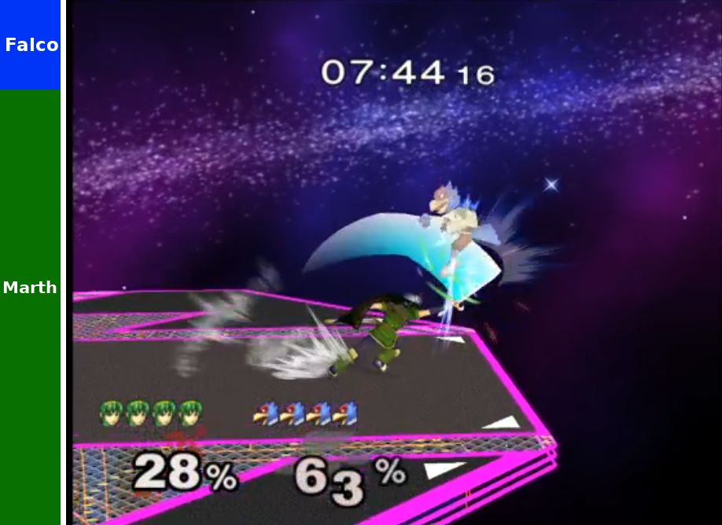
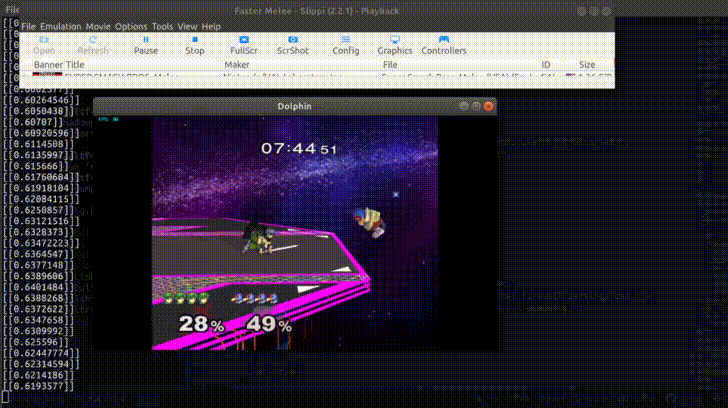

# SmashBot Analysis

An AI-powered advantage bar for Melee.

(Image Mockup. There is no graphical frontend yet)

## What Does the Analysis Mean?
The analysis is SmashBot's best prediction on who will win the *current stock*, given the current game state.

Future work will consider who will win the entire game, but not yet.

## BETA

The SmashBot analysis isn't quite ready to be used by tournaments just yet. It works, but needs needs some more programming to be ready for the spotlight.

## What Information Does the Analysis Consider?
The SmashBot analysis looks at the current game state as a snapshot in time. So it does not see things like:
- Results of previous matches
- Momentum, or who is currently "on a comeback"

Specifically, the analysis is fed:
- Both player's characters
- Both player's damage
- Both player's x,y coordinates
- Current stage

## How does the SmashBot Analysis Work?
It uses a neural network (TensorFlow) trained on a mountain of SLP files.

Training works in a two phase process.
 1. Building the dataset
 2. Training the model

### Building the Dataset
Building the dataset involves taking a mountain of SLP files and extracting key information from them. This means the information above (character x,y coords, etc...) but also the results of the match so the machine can learn from it.

 This can be executed by placing your SLP files inside a folder named `training_data/` and then running:

 `./advantage_bar.py --build`

This will iterate through each of the SLP files using `libmelee` and extract the important information into `.tfrecord` files, placed inside `tfrecords/`.

When this completes, you should have a `tfrecords/` folder filled with `*.tfrecord` files. Roughly one-per SLP file.

### Training the Model
After having build the tfrecord dataset above, you can begin training.

`./advantage_bar.py --train`

When finished, the model will be saved to disk in `savedmodel/`

### Running a Proof-of-Concept
Once you've trained your model (or gotten a pre-trained one) you can start running predictions.

For this part, you'll need a full `libmelee` setup. Follow the instructions here: https://github.com/altf4/libmelee

Then run:

`./advantage_bar.py --predict PATH_TO_DOLPHIN`

Dolphin will boot up and you'll notice prediction values being printed to STDOUT during a match. It will look something like this: (Note the numbers on the left)

